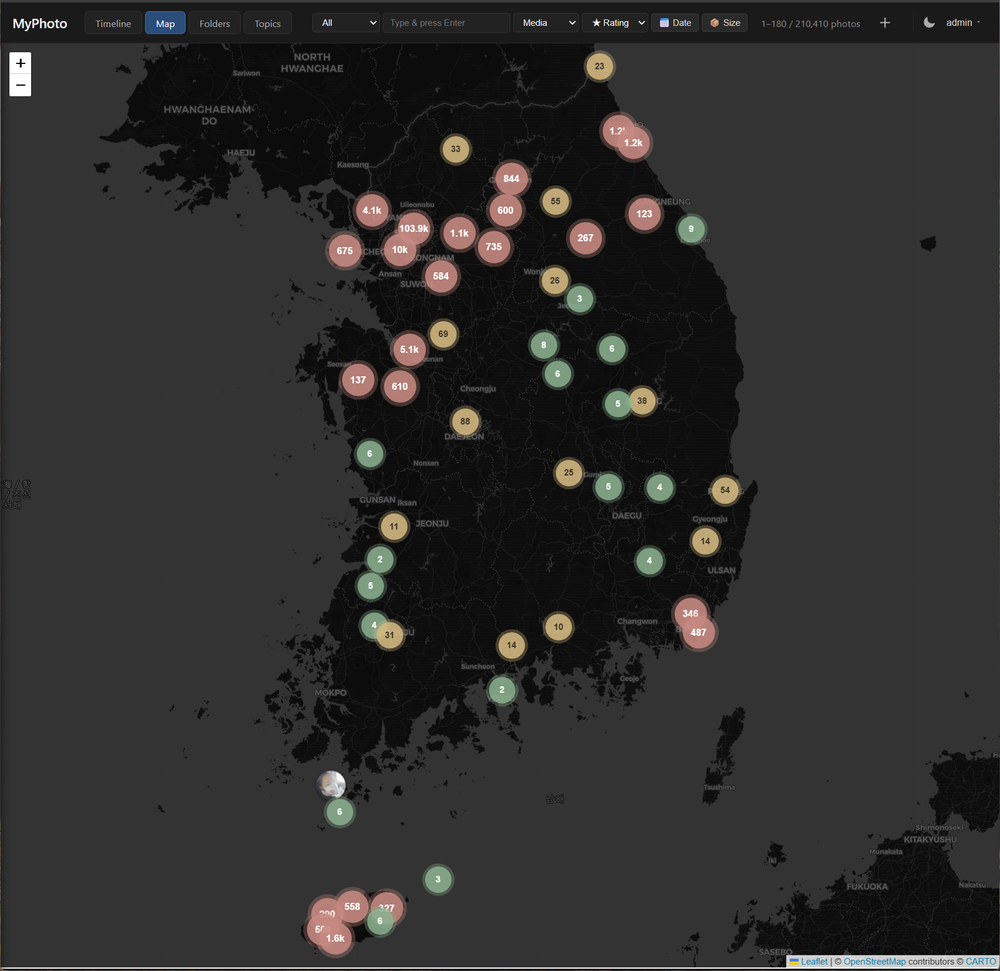

# MyPhotos



> 한국어 / [English](#english)

직접 운영하는 사진 카탈로그. 메타데이터 인덱싱과 웹 브라우징을 지원합니다.

- **백엔드**: FastAPI + SQLite (WAL, FTS5, R-Tree)
- **워커 2개**: 인덱싱 워커(스캔/EXIF/썸네일) + ML 워커(객체 검출/CLIP 임베딩/얼굴 검출·클러스터링)
- **저장소**: 기존 사진 폴더는 읽기 전용으로 인덱싱. 썸네일과 DB는 `data/` 아래에 보관
- **자동 분류** (선택): YOLOv8(객체) + CLIP(주제/장면) + YuNet/SFace(얼굴) + OCR(RapidOCR 텍스트 추출) — 모두 ONNX, CPU 전용. 신규 사진 자동 처리(설정) 지원
- **검색**: FTS5 통합 검색(파일명·태그·댓글·**OCR 텍스트**) + 날짜/GPS/텍스트 유무 필터
- **대상 호스트**: Synology DSM (DS3622xs+, x86_64), systemd로 실행

> OCR(사진 속 글자 검색)은 선택 기능입니다 — `uv pip install rapidocr` 후 관리 → 색인 → ML 자동 분류에서 실행. 한국어 모델 자동 다운로드. 자세한 설치/사용은 [설치 후 운영 문서](docs/operations/post-install.md#ocr-텍스트-검색-선택)를 참고하세요.

## 디렉토리 구조

```text
myphotos/
├── app/                # 애플리케이션 코드
│   ├── api/            # FastAPI 앱 (uvicorn 엔트리)
│   ├── admin/          # 관리용 CRUD (roots, jobs, ml)
│   ├── worker/         # 스캐너 + 인덱싱 잡 러너 (systemd 엔트리)
│   ├── worker_ml/      # ML 잡 러너 — YOLO / CLIP / face (별도 systemd 엔트리)
│   └── web/            # HTMX 템플릿 / 정적 파일
├── config/
│   ├── default.toml    # 기본 설정 (커밋됨)
│   └── local.toml      # 호스트별 오버라이드 (커밋 안 됨)
├── data/               # 런타임 (커밋 안 됨) — DB, 썸네일, 모델, 로그, 휴지통
│   └── models/         # ONNX 모델 (yolo / clip / face) — install-ml-models.sh
├── vendor/             # OS별 바이너리 (exiftool, ffmpeg)
├── alembic/            # DB 마이그레이션
├── scripts/            # 부트스트랩, systemd 설치, ML 모델 다운로드/업로드
├── systemd/            # 유닛 템플릿 (api / worker / ml-worker)
└── desktop/            # 데스크톱 앱 (PySide6) — 갤러리 뷰어 + 서버 관리
```

## 설치

대상 환경별로 별도 가이드:

| 환경 | 가이드 |
| --- | --- |
| **Synology NAS** (DSM 7.x, systemd) | [docs/install/synology.md](docs/install/synology.md) |
| **Docker** (DSM Container Manager / Linux+Docker / Windows+Docker Desktop) | [docs/install/docker.md](docs/install/docker.md) |
| **일반 Linux** (Debian/Ubuntu/Fedora/Arch + systemd) | [docs/install/linux.md](docs/install/linux.md) |
| **Windows** (개발용) | [docs/install/windows.md](docs/install/windows.md) |
| **macOS** (개발용 · Intel/Apple Silicon) | [docs/install/macos.md](docs/install/macos.md) |

설치가 끝난 뒤의 운영은 주제별로 분리되어 있습니다 — 어느 환경(Synology / Linux / Windows)이든 동일하게 적용됩니다.

## 설치 후 운영

| 주제 | 가이드 |
| --- | --- |
| **일상 운영** — 코드 업데이트 / watcher / 백업 / 트러블슈팅 | [docs/operations/post-install.md](docs/operations/post-install.md) |
| **외부 DB (MariaDB / PostgreSQL)** — DSN 설정, 마이그레이션, 백업 | [docs/operations/external-db.md](docs/operations/external-db.md) |
| **다른 호스트로 이전** — NAS / Linux / Windows 간 (재인덱싱 없이) | [docs/operations/porting.md](docs/operations/porting.md) |
| **HTTPS (선택 · 권장)** — 외부 접속 / PWA 오프라인 / "현재 위치" 기능 | [docs/operations/post-install.md](docs/operations/post-install.md#https-설정-선택--권장) |

각 가이드는 Linux/Synology (systemd)와 Windows (`myphotos.ps1`) 명령을 함께 다룹니다.

## 데스크톱 앱 (선택)

브라우저 대신 쓰는 Windows / macOS 데스크톱 앱입니다. 하나의 창에서:

- **갤러리 뷰어** — 웹 프런트엔드를 그대로 임베드(QWebEngine). 원격 NAS든 로컬 서버든 어느 MyPhotos 서버에나 접속. 로그인 세션 유지.
- **서버 관리** — Web/API · 인덱싱 워커 · ML 워커를 앱에서 **시작 / 정지 / 재시작**, 라이브 로그, **인덱싱 진행 상태**(작업 큐 + 사진 파이프라인) 모니터링. 터미널 없이 단독 운영 가능.
- **트레이 상주** — 최소화·닫기 시 트레이로 들어가 워커는 계속 실행. 트레이 메뉴에서 완전 종료.

소스에서 바로 실행(빌드 없이):

```bash
cd desktop
python3 -m venv .venv            # 또는: uv venv --python 3.11 .venv
.venv/bin/python -m pip install -r requirements.txt
.venv/bin/python app.py          # Windows: .\.venv\Scripts\python app.py
```

설정·빌드(단일 실행파일)·문제 해결은 [desktop/README.md](desktop/README.md)를 참고하세요.

---

## English

Self-hosted photo catalog with metadata indexing and web browsing.

- **Backend**: FastAPI + SQLite (WAL, FTS5, R-Tree)
- **Two workers**: indexing (scanning / EXIF / thumbnails) and ML (object detection / CLIP embeddings / face detection + clustering), each as its own systemd unit
- **Storage**: indexes existing folders read-only; thumbnails and DB live inside `data/`
- **Auto-classification** (optional): YOLOv8 (objects) + CLIP (topics/scenes) + YuNet/SFace (faces) + OCR (RapidOCR text extraction) — all ONNX, CPU only; can auto-run on new photos
- **Search**: unified FTS5 (filename / tags / comments / **OCR text**) + date / GPS / has-text filters
- **Target host**: Synology DSM (DS3622xs+, x86_64) via systemd

> OCR (search by text in photos) is optional — `uv pip install rapidocr`, then run it from Admin → Indexing → ML auto-classify (Korean model auto-downloads). See [post-install docs](docs/operations/post-install.md) for setup/usage.

## Layout

```text
myphotos/
├── app/                # application code
│   ├── api/            # FastAPI app (uvicorn entry)
│   ├── admin/          # admin CRUD (roots, jobs, ml)
│   ├── worker/         # scanner + indexing job runner (systemd entry)
│   ├── worker_ml/      # ML job runner — YOLO / CLIP / face (separate systemd entry)
│   └── web/            # HTMX templates / static
├── config/
│   ├── default.toml    # built-in defaults (tracked)
│   └── local.toml      # per-host overrides (NOT tracked)
├── data/               # runtime (NOT tracked) — DB, thumbs, models, logs, trash
│   └── models/         # ONNX weights (yolo / clip / face) — install-ml-models.sh
├── vendor/             # OS-specific binaries (exiftool, ffmpeg)
├── alembic/            # DB migrations
├── scripts/            # bootstrap, systemd install, ML model download/upload
├── systemd/            # unit templates (api / worker / ml-worker)
└── desktop/            # desktop app (PySide6) — gallery viewer + server manager
```

## Install

Pick the guide that matches your environment:

| Environment | Guide |
| --- | --- |
| **Synology NAS** (DSM 7.x, systemd) | [docs/install/synology.md](docs/install/synology.md) |
| **Docker** (DSM Container Manager / Linux+Docker / Windows+Docker Desktop) | [docs/install/docker.md](docs/install/docker.md) |
| **Generic Linux** (Debian/Ubuntu/Fedora/Arch + systemd) | [docs/install/linux.md](docs/install/linux.md) |
| **Windows** (dev) | [docs/install/windows.md](docs/install/windows.md) |
| **macOS** (dev · Intel/Apple Silicon) | [docs/install/macos.md](docs/install/macos.md) |

Post-install ops are split by topic — they apply equally to every environment (Synology / Linux / Windows).

## Post-install

| Topic | Guide |
| --- | --- |
| **Day-to-day ops** — code update / watcher / backups / troubleshooting | [docs/operations/post-install.md](docs/operations/post-install.md) |
| **External DB (MariaDB / PostgreSQL)** — DSN setup, migration, backups | [docs/operations/external-db.md](docs/operations/external-db.md) |
| **Porting to a new host** — across NAS / Linux / Windows (no re-index) | [docs/operations/porting.md](docs/operations/porting.md) |
| **HTTPS (optional · recommended)** — internet access / PWA offline / "use my location" | [docs/operations/post-install.md](docs/operations/post-install.md#https-설정-선택--권장) |

Each guide covers both Linux/Synology (systemd) and Windows (`myphotos.ps1`) commands.

## Desktop app (optional)

A Windows / macOS desktop app to use instead of a browser. One window, two things:

- **Gallery viewer** — embeds the web frontend (QWebEngine); connects to any MyPhotos server (remote NAS or a local one). Login session persists.
- **Server manager** — **start / stop / restart** the Web/API + indexing worker + ML worker from the app, with live logs and **indexing progress** (job queue + photo pipeline). Run MyPhotos standalone, no terminal needed.
- **Tray-resident** — minimising or closing keeps it running in the tray so the workers stay up; quit fully from the tray menu.

Run from source (no build):

```bash
cd desktop
python3 -m venv .venv            # or: uv venv --python 3.11 .venv
.venv/bin/python -m pip install -r requirements.txt
.venv/bin/python app.py          # Windows: .\.venv\Scripts\python app.py
```

See [desktop/README.md](desktop/README.md) for configuration, single-file builds, and troubleshooting.

